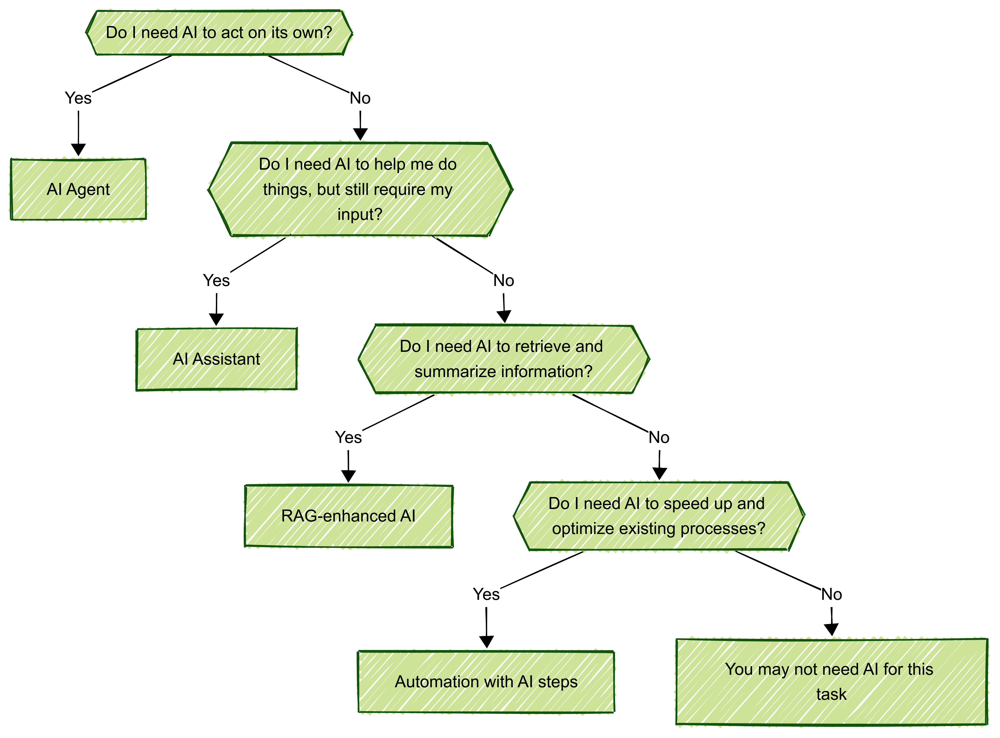

## Introduction

These days, it feels like everything is being labeled an "AI Agent." From chatbots to simple automated workflows, the term is everywhere. But let’s be honest—most of what people call AI Agents are actually something else. This misunderstanding can lead to unrealistic expectations, wasted resources, and frustration when an AI tool doesn’t behave as expected.

The reality? Not all AI is built the same. Some AI helps you get things done (AI Assistants), some AI enhances search results (RAG), and some AI is just automation with a bit of intelligence thrown in. Let’s break this down in a way that actually makes sense, so you can figure out what you need—and avoid the hype trap.

---

## AI Agents: True Autonomy in Action

An AI Agent isn’t just a chatbot or a tool that answers questions—it’s an AI that can **plan, make decisions, and take actions independently**. These systems can:
- **Identify tasks and break them down** without needing every step predefined.
- **Make decisions dynamically**, adjusting based on real-time information.
- **Act autonomously**, meaning they don’t just suggest actions but actually carry them out.

#### Example:
Imagine an AI Agent that manages your supply chain. It monitors stock levels, predicts shortages, evaluates suppliers, negotiates contracts, and places orders—all without you lifting a finger. That’s a real AI Agent.

---

## AI Assistants: Smart Helpers, Not Decision-Makers

AI Assistants are fantastic at making life easier, but they don’t work autonomously. They’re designed to support you, not replace you. Key characteristics include:
- **Human-in-the-loop oversight**—you’re still making the final call.
- **Helpful suggestions and task completion** rather than independent action.
- **Interaction-driven responses**, meaning they wait for user input.

#### Example:
Siri, Google Assistant, and ChatGPT are AI Assistants. They answer your questions, set reminders, and help with small tasks, but they don’t autonomously make decisions on your behalf.

---

## RAG (Retrieval-Augmented Generation): AI That Knows More

Ever used ChatGPT and wished it had up-to-date knowledge? That’s where **Retrieval-Augmented Generation (RAG)** comes in. Instead of just predicting words based on patterns, RAG-enhanced AI pulls in real-time information from external sources. But remember:
- **RAG doesn’t make decisions—it just provides better answers.**
- **It reduces hallucinations by grounding AI in real data.**
- **It’s great for research-heavy applications, but not for task execution.**

#### Example:
A legal research tool powered by RAG can pull case law from databases before answering legal questions. It’s not an AI Agent—it just retrieves and formats information more effectively.

---

## Automation with an AI Step: Smarter, But Not Autonomous

Many AI-powered workflows are just **automation with AI sprinkled in**. These systems:
- **Execute predefined workflows** but may use AI for decision-making along the way.
- **Follow clear rules**, meaning they don’t dynamically adapt like true AI Agents.
- **Improve efficiency, but won’t replace complex decision-making.**

#### Example:
A customer support chatbot that classifies customer issues and routes them to the correct department is automation with an AI step, **not** an AI Agent.

---

## How to Know What You Need

Now that we’ve cleared up the confusion, let’s talk about what you actually need. Ask yourself these questions:

#### 1. Do I need AI to **act on its own**?
- **Yes?** You need an **AI Agent**.
- **No?** Keep reading.

#### 2. Do I need AI to **help me do things, but still require my input**?
- **Yes?** You need an **AI Assistant**.
- **No?** Keep reading.
#### 3. Do I need AI to **retrieve and summarize information**?
- **Yes?** You need **RAG-enhanced AI**.
- **No?** Keep reading.
#### 4. Do I need AI to **speed up and optimize existing processes**?
- **Yes?** You need **automation with AI steps**.

---

## Why This Matters

Using the right AI for the right job can save you time, money, and frustration. Mislabeling AI solutions leads to disappointment when an "agent" doesn’t actually do anything autonomously. By understanding these distinctions, businesses and consumers can make informed decisions that align with their actual needs.

> "Understanding what AI can do and how it fits into your strategy is the beginning, not the end, of that process." — Andrew Ng

---

## Conclusion

Not every AI is an AI Agent, and that’s okay. Whether you need an AI Assistant, a RAG-powered research tool, or an automation solution with an AI boost, knowing the difference is the key to success.

Before jumping on the AI hype train, take a step back and ask: What do I actually need my AI to do? Once you have the answer, you’ll know exactly which AI technology fits your needs best.

